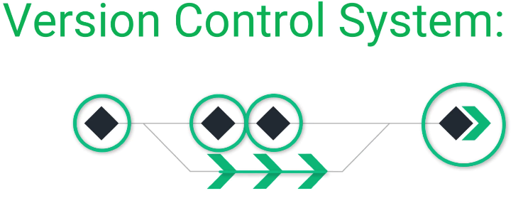
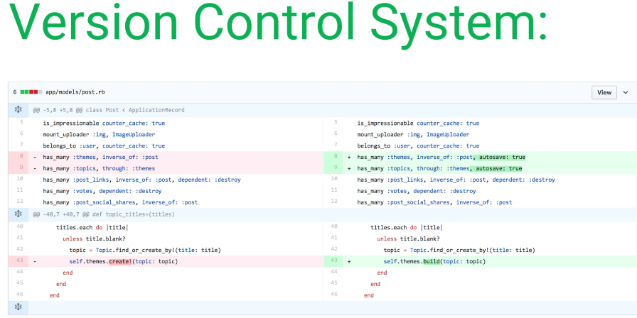

# 1. Introduction to GIT

**Open Source**
-	free to use and developed by community of developers. 
-	Download for free and start working for Project. 
-	Team of talented developers adding new features.

**Distributed**
-	Centralized code repository, in order to have all together and keep track of changes.
-	Checkout of the code, in order to implement a feature. 
-	There is a centralized repo that can access the same code you and domes developers.

**Version Control System**
-	Gives ability to create milestones for a project.
-	Allow to create milestones

dfgdfg

-	If you break something on the server/code; this allows you to revert to that previous ooints/changes. Restrore the working versions.

-	Each new version does not include all the data, only the specific changes you make.

# 2. GIT vs GitHub
Basically, GitHub is a Hub for Git projects.
GitHub is a repository to create, modify and share code.

# 3. Repositories
Simply wrappers and hosting providers for GIT. 
### Github
general purpose providers out there. It works very well in team situations it has a good issue tracker and it's very easy to be able to have one spot I can go to with all of my centralized repositories, from a pricing perspective, it's not bad either.
### GitLab
If you work on an Enterprise, or if you have a number of requirements such as working with LDAP which is how you can connect a Windows Active Directory set of authentication protocols directly into your code repositories. 
### BickBucket
This means it also works pretty well for an enterprise environment. Price is more affordable. Unlimited private repos inside of their free tier.

# 4. Configure Git
Follow the instructions to install and configure, git name, email, etc.
Connect Git to GitHub:
-	HTTPS encrypted protocol, 
-	SSH secure shell, 
Nothing one better than the other.
