# Clases en Python

Entre las diferentes tipos de elementos en Python, se encuentran un tipo de estructura que se utiliza para definir un nuevo tipo de objeto, llamadas **clases**.

Principalmente, las clases en Python sirven para agrupar **datos (que son los atributos)** y **funciones (que son los métodos)** que están relacionados en un solo objeto. Esta agrupación permite la creación de instancias de objetos que comparten características comunes definidas en la clase.

Las clases permiten la creación de objetos con propiedades y comportamientos específicos, lo que ayuda a organizar y modular el código, mejorar la legibilidad, facilitar la reutilización del código y mantener un código más limpio y estructurado.

En cuanto a la sintaxis, siempre debe hacerse escribiendo **class** y luego el nombre de la clase con la **primera letra en mayúscula**. Por defecto, el primer atributo en las clases siempre está denominado como **self**. A parte de self, se pueden añadir más atributos y funciones a la clase. Para entender mejor el uso de las clases, a continuación se expone un **ejemplo**:

**Ejemplo**: Se pretende crear una clase que se llame `Usuario`, y se le añadirán dos funciones `saludos_1` y `saludos_2`. En este caso, solo se usa un atributo, por defecto, self.

```python
class Usuario:
  def saludos_1(self):
	return "Eres un usuario nuevo"

  def saludos_2(Self):
	return "No eres un usuario nuevo"
```

Además de ello, se crea una instancia, es decir, se crea un objeto a partir de la clase. Esto se realiza utilizando el nombre de la clase seguido de paréntesis.

```python
persona_1 = Usuario()   # Creación de la instancia.
```

Para acceder a los atributos y los métodos, se utiliza la notación `.`, poniendo primero la instancia y luego el método que se quiere acceder. A continuación, se accede con la misma instancia a métodos diferentes, resultado en diferentes respuestas:
 
```python
print(persona_1.saludos_1())
print(persona_1.saludos_2())
```


# Método constructor
En las clases, también se pueden utilizar métodos específicos como el **método constructor**.
En este caso, el método constructor tiene la particularidad que se llama por `__init__` y se ejecuta **automáticamente** cuando se crea una instancia de la clase. Este método siempre se usa para inicializar los atributos de la clase.
Para entenderlo mejor, se expone el siguiente **ejemplo**:

```python
class Factura:
  def __init__(self, nombre, apellidos, importe):
	self.nombre = nombre
	self.apellidos = apellidos
	self.importe = importe

  def saludos(self):
	return f"Hola {self.nombre} {self.apellidos}, su compra total asciende a un total de {self.importe}€."

cliente_1 = Factura("Aitor", "Atxaerandio", 100)
```
En este caso, sólo hemos accedido al segundo método, pero como el primero `__init__` siempre se ejecuta automáticamente, tendremos el siguiente resultado:

```python
print(cliente_1.saludos())	# Hola Aitor Atxaerandio, su compra total asciende a un total de 100€.
```

# Propiedades y decoradores en las clases
Las propiedades de las clases en Python son atributos especiales que permiten controlar el acceso a los datos de una clase y automatizar la llamada a métodos `getter` y `setter`. Al utilizar las propiedades, se garantiza un acceso más intuitivo a los atributos de la clase y se elimina la necesidad de llamar explícitamente a métodos `setter`  y `getter`.

Antes de saber que son los decoradores y los métodos getter y setter, hay que saber la sintaxis de los atributos de python.

Con el fin de no reescribir y eliminar atributos, en Python se utilizan las barra-bajas para determinar si un atributo es **privado** y/o **protegido**. Depende del objetivo, se pueden crear atributos privado o protegido:

 - Para crear atributos protegidos se usa `_` antes del atributo.
 - Para crear atributos privados se usan `__` antes del atributo.

Estos atributos, al ser privados o protegidos, no pueden modificarse por sí solos, y se necesita de métodos especiales para poder acceder a ellos. Aquí es donde entra en juego los métodos `setter` y `getter`, que son parte fundamental de python y se usan para modificar los atributos de una clase de manera controlada.

# Funciones Setter y Getter
En el caso del método ``getter``, se emplea para obtener el valor de un atributo privado, permitiendo una lectura segura de los datos almacenados en una clase. Para los métodos getter, se usa la sintaxis `@property` para obtener el valor de un atributo privado, **ubicándolo delante del método** que queremos que devuelva el valor.

En el caso de ``setter``, se usa para asignar un valor a un atributo privado, lo que posibilita la modificación controlada de dicho atributo. En este caso, la sintaxis a utilizar es ``@nombre_método.setter`` delante del método que queremos modificar.

Para explicarlo mejor, se describe un **ejemplo** a continuación:

```python
class Factura:

	def __init__(self, cliente, total):
    	self._cliente = cliente
    	self._total = total

	def texto(self):
    	return f'{self._cliente} debe en total: {self._total}€'

	@property      	# Método Getter
	def client(self):
    	return self._cliente

	@client.setter  	# Método Setter
	def cliente(self, cliente):
    	self._cliente = cliente

	@property      	# Método Getter
	def total(self):
    	return self._total

```

En esta clase llamada factura tiene como objetivo representar una factura con información sobre un cliente y el total de la factura.

1. **Método __ __init__ __** :arrow_right: Es un constructor de la clase, y se ejecuta automáticamente e inicializa los atributos de la clase, que son cliente y total. Cliente almacena el nombre del cliente y total almacena el total de la factura.
2. **Método texto** :arrow_right: Este método devuelve un string mostrando el texto de la factura.
3. **Decorador @property y métodos cliente y total.**
   - Decorador `@property`: se usa para crear un método **getter** que permite acceder al valor del atributo como si fuera un atributo de lectura.
  	- Método `cliente`: es un getter que devuelve el valor del atributo cliente.
  	- Método `total`: es otro getter que devuelve el valor del atributo total.
   - Decorador `@cliente.setter`: se usa para crear un método **setter** asignando un nuevo valor al atributo cliente.
4. Después de crear la clase, podemos crear instancias y obtener valores:

```python
google = Factura('Pedro', 75)	# Crear una instancia de Factura con el cliente Pedro y total 75.
print(google.texto())        	# Se imprime el resultado del método texto y que muestra "Pedro debe en total: 75€"

print(google.cliente)	# Se accede a los valores del método cliente y se imprime "Pedro".
print(google.total)	# Se accede a los valores del método total y se imprime "75".

google.cliente = 'Miguel' 	# Se modifica el valor de cliente a través de la propiedad cliente y se imprime un nuevo valor.
print(google.cliente)	# Miguel
```

# Métodos Dunder

Los métodos dunder son métodos especiales que se utilizan para definir el comportamiento de los atributos en las clases de Python. Dunder viene de "double underscore", que significa "doble guion bajo/barra baja" y hace referencia a cómo es su sintaxis.

La particularidad que tienen los métodos dunder es que se llaman automáticamente por el intérprete de Python. El objetivo final del uso de métodos dunder es crear interfaces más intuitivas y crear un código más limpio y ordenado entre otras.

En Python hay numerosos métodos dunder para diversas funcionalidades como realizar operaciones aritméticas (métodos `__add__`, `__sub__`, `__mul__`, etc), operaciones de comparación (`__eq__`, `__lt__`, etc), operaciones de ciclo de vida (la anteriormente vista `__init__` para iniciar, `__del__`, `__new__`, etc), u operaciones de representación (`__str__` o `__repr__`), entre otras.

Entre los métodos dunder más utilizados y comunes hasta la fecha se encuentran `__init__`, `__str__` y `__repr__`, que se explican a continuación:

- `__init__` :arrow_right: Sirve para diferenciar los métodos dados por defecto o los definidos por el usuario.
- `__str__` :arrow_right: Se usan principalmente para el debugging, devuelven la representación en forma de string de un objeto, el cual es legible por humanos (human-readable). Básicamente es fácil de leer.
- `__repr__` :arrow_right: Similar al `__str__`, se usa para devolver un a salida en bruto/crudo, pero se utiliza más para mostrar directamente los valores, con una forma más «objeto». Por tanto, no es tan fácil de leer.

Para entender mejor el uso de los métodos dunder, se expone un **ejemplo** a continuación:
```python
class Asistencia:
  def __init__(self, nombre, apellido, edad):
  	self.nombre = nombre
  	self.apellido = apellido
  	self.edad = edad

  def __str__(self):
  	return f"El alumno {self.nombre} {self.apellido} tiene {self.edad} años"

  def __repr__(self):
  	return f"El alumno <valor: nombre: {self.nombre}> <valor: apellido: {self.apellido}>, tiene <valor: edad: {self.edad}> años"

datos = Asistencia("Aitor", "Atxaerandio", 15)

print(str(datos)) 	# El alumno Aitor Atxaerandio tiene 15 años
print(repr(datos))	# El alumno <valor: nombre: Aitor> <valor: apellido: Atxaerandio>, tiene <valor: edad: 15> años
```

En este **ejemplo** se define la clase `Asistencia` que tiene atributos de `nombre`, `apellido` y `edad`.

1. La clase tiene un constructor `__init__` que inicia los atributos `nombre`, `apellidos` y `edad` automáticamente cuando se llama a la clase.
2. La clase tiene dos métodos dunder para representar la instancia de la clase de manera legible:
   - Método `__str__`: Devuelve la representación de cadena legible para los humanos (human-readable), que en este caso indica el `nombre`, `apellido` y `edad` del alumno.
   - Método `__repr__`: Devuelve la representación de cadena más formal y detallada, lo cual hace que siga siendo legible pero algo más difícil, ya que detalla todo de forma más técnica.
 
En el **ejemplo** se crea una instancia de la clase `Asistencia` con el `nombre` **Aitor**, `apellido` **Atxaerandio** y `edad` **15**, y se guarda en la variable datos.
Se imprimen las cadenas usando `print(str(datos))` y `print(rpr(datos))`.


# Iteradores en métodos dunder

Dentro de los métodos dunder se pueden utilizar iteradores. Los iteradores más comunes son `__iter__()` y `__next__()` que se usan indistintamente depende del objetivo de la iteración. Son elementos realmente útiles cuando se trabaja con sets de datos grandes, siendo más eficientes en cuanto a rendimiento al consumir menos recursos del sistema. Entre los los iteradores más comunes en los métodos dunder se encuentran:
- `__iter__()` :arrow_right: Devuelve un iterador para un objeto determinado (array, tupla, lista, etc), crea un objeto que puede ser llamado.
- `__next__()` :arrow_right: En este caso, devuelve el siguiente item de la iteración, devolviendo `StopIteration` cuando no hay más ítems disponibles.

Para entender mejor el uso de los iteradores en las clases, se expone un **ejemplo** a continuación:

```python
class Aula:
  def __init__(self, alumnos):
  	self.alumnos = alumnos                    	#guarda la lista de alumnos.
  	self.ix_ult_alum = (len(self.alumnos) - 1)	#guarda el índice del último alumno en la lista.

  def __iter__(self):                           	# se hace que la clase sea iterable
  	self.n = 0                                	# se inicia un contador en 0
  	return self                               	# se devuelve self

  def get_player(self, n):                      	# se crea un método para obtener el jugador. En este caso recibe un índice.
  	return self.alumnos[n]                    	# devuelve el alumno en ese índice.

  def __next__(self):
  	if self.n < self.ix_ult_alum:             	# es n menor que el índice del último alumno?
      		alumno = self.get_player(self.n)      	# si es así, se obtiene el jugador en ese índice
      		self.n += 1                           	# incrementa en 1 el contador
      		return alumno
  	elif self.n == self.ix_ult_alum:          	# si el contador es igual al índice del último alumno
      		alumno = self.get_player(self.n)
      		self.n = 0                            	# no suma nada al contador y devuelve el alumno
      		return alumno

lista nombres = [
  "Miguel",
  "Aitor",
  "Pedro",
  "Jose",
  "Iñaki",
]
```
Creación del objeto `lista aula` de la clase `Aula` pasándole la lista de nombres:

```python
lista aula = Aula(lista nombres)
```
Creación del iterador informe a partir de la `lista_aula`, usando la función `iter()`.              	 

```python
informe = iter(lista_aula)                     	 
```

Se imprime cada alumno. El método `__next__()` de la clase `Aula` se encarga de devolver cada alumno de la lista de forma secuencial, reiniciando el contador cuando se llega al final de la lista.

```python
print(next(informe))    	# Miguel           	 
print(next(informe))    	# Aitor
print(next(informe))    	# Pedro
print(next(informe))    	# Jose
print(next(informe))    	# Iñaki
print(next(informe))    	# Miguel
print(next(informe))    	# Aitor
```


# Herencia de clases

La herencia de clases es un concepto que permite a una clase heredar atributos y métodos de otra clase.
Este mecanismo facilita la reutilización de código y la organización jerárquica de las clases.
La herencia de clases se establece al crear una clase que hereda de otra clase, donde la clase hija hereda todos los atributos y métodos de la clase madre.

Para entenderlo mejor, se expone un **ejemplo** a continuación:

```python
# clase MADRE

class Coche:
  def __init__(self, marca, modelo, tamaño):
	self.marca = marca
	self.modelo = modelo
	self.tamaño = tamaño

  def mostrar(self):
	return f"Marca: {self.marca}, Modelo: {self.modelo}, Tamaño:"

#clase HIJA
class Componente(Coche):
  def kilometros(self):
	return "Muchos kilometros"
```
Se crean objetos `coche_1` y `coche_2`, cada una en una clase diferente:

```python
coche_1 = Coche("Toyota", "Corolla", "Grande")

coche_2 = Componente("Ford", "Mustang", "Grande")
```
A la hora de imprimir:
```python
print(coche_1.mostrar())      	# Marca: Toyota, Modelo: Corolla, Tamaño:
#print(coche_1.kilometros())  	# Error --> No se puede acceder a un método de la clase hija
```
Las clases hijas **SI** pueden acceder a los atributos y a los métodos de las clases madres, **pero no viceversa**.

Es el caso del objeto `coche_1` cuando quiere acceder al método `kilometros()` de la clase `Componente`. El resultado da en un **error**.
```python
print(coche_2.mostrar())      	# Marca: Ford, Modelo: Mustang, Tamaño:
print(coche_2.kilometros())  	# Muchos kilometros
```


# Polimorfismos en Python

En Python, el polimorfismo se refiere a la capacidad de objetos de diferentes clases de ser tratados de manera similar utilizando el mismo interfaz, pero mostrando comportamientos diferentes. Esto se puede conseguir mediante el uso de clases y de herencia de clases.

En el primer **ejemplo**, se describe un **polimorfismo con clase**, mientras que en el segundo, un **polimorfismo con herencia de clases**:

**1. Polimorfismo de clase**

```python
class España:
  def __init__(self, nombre, capital, continente):
	self.nombre = nombre
	self.capital = capital
	self.continente = continente
  def descripcion(self):
	return f"El país {self.nombre} tiene como capital {self.capital} y se encuentra en el continente {self.continente}"


class Portugal:
  def __init__(self, nombre, capital, continente):
	self.nombre = nombre
	self.capital = capital
	self.continente = continente

  def descripcion(self):
	return f"El país {self.nombre} tiene como capital {self.capital} y se encuentra en el continente {self.continente}"
```
Ambas clases tienen métodos con el mismo nombre, `__init__` y `descripcion`, al crear objetos de estas clases y recorrerlos en un bucle, se muestra como cada objeto responde al mismo mensaje de forma distinta, demostrando **polimorfismo**:

```python
objeto_españa = España("España", "Madrid", "Europa")
objeto_portugal = Portugal("Portugal", "Lisboa", "Europa")

print(objeto_españa.descripcion())	# El país España tiene como capital Madrid y se encuentra en el continente Europa
print(objeto_portugal.descripcion())   # El país Portugal tiene como capital Lisboa y se encuentra en el continente Europa
```

**2. Polimorfismo con Herencia**

```python
class Animal:
  def __init__(self, nombre, velocidad):
	self.nombre = nombre
	self.velocidad = velocidad
  def movimiento(self):
	print("Los animales se mueven con velocidades diferentes")

class Perro(Animal):
  def movimiento(self):
	print(f"En el caso del {self.nombre} se mueve {self.velocidad}")

class Koala(Animal):
  def movimiento(self):
	print(f"En el caso del {self.nombre} se mueve {self.velocidad}")

class Lapa(Animal):
  def movimiento(self):
	print (f"En el caso de la {self.nombre} se mueve {self.velocidad}")
```
En este caso también, tenemos clases hijas que tienen el mismo método. Después de crear los objetos de estas clases e imprimirlas, se muestra que cada objeto responde de forma distinta.
En estos casos, cada clase hija sobrescribe el método movimiento de la clase `Animal`.

```python
animal_1 = Animal("Perro", "rapido")
animal_2 = Perro("perro", "rapido")
animal_3 = Koala("koala", "lento")
animal_4 = Lapa("lapa", "lenta")

print(animal_1.movimiento())   # Los animales se mueven con velocidades diferentes
print(animal_2.movimiento())	# En el caso del perro se mueve rápido
print(animal_3.movimiento())	# En el caso del koala se mueve lento
print(animal_4.movimiento())	# En el caso de la lapa se mueve lenta
```


# API
Las APIs son la Interfaz de Programación de Aplicaciones, o en su acrónimo en inglés, "Application Programming Interface". Las APIs son un conjunto de funciones y procedimientos que permite integrar sistemas, permitiendo que sus funcionalidades puedan ser reutilizadas por otras aplicaciones o software.

En breves palabras, las APIs son la columna vertebral de los sistemas, permitiendo la comunicación entre aplicaciones y sistemas. Es una especie de servidor con el cual se puede comunicar y recibir datos de vuelta, siendo su principal función la de facilitar la interacción entre los elementos que componen el sistema.

**Entre los usos más destacables de las APIs están:**

**1.** Establecer una conexión entre los sistemas y permite la accesibilidad de datos.<br>
**2.** Permite monitorizar los usuarios y su actividad.<br>
**3.** Incrementa la seguridad.<br>

Un **ejemplo** muy claro del uso de las APIs es la **conexión entre un cliente (un usuario desde su ordenador) y una base de datos**. El cliente quiere acceder a ciertos datos que están localizados en una base de datos, y para ello, necesita hacer una petición (request) a una API. Esta API a su vez hará esa petición a la base de datos y recibirá una respuesta, que son los datos solicitados. Tras ello, la API manda una respuesta al cliente de nuevo, que son dichos datos que ha solicitado. El mismo mecanismo ocurriría si en lugar de solicitar datos a una base de datos, se realizaría una petición a un servidor web.<br>
Se observa un resumen muy simple del funcionamiento de las APIs en la siguiente imagen:

<div align="center">
	
</div>

# Verbos en las APIs
Los verbos en las APIs hacen referencia a los métodos que se van a utilizar cuando se usan. Dependiendo si se quiere consultar, actualizar, crear o eliminar datos, se utilizará un verbo u otro.
En las APIs se distinguen principalmente los siguientes verbos:

**1. GET** :arrow_right: Este método está pensado para la lectura de datos, es decir, realizar una consulta sobre un objeto en concreto.<br>
**2. POST** :arrow_right: Este método está pensado para la creación de nuevos recursos, así como crear un nuevo usuario, contenido, etc.<br>
**3. PUT** :arrow_right: Este método es para la actualización de un recurso concreto. Por **ejemplo**, se usaría este verbo para la actualización de datos de un usuario en particular.<br>
**4. DELETE** :arrow_right: Para borrar recursos, como por **ejemplo**, eliminación de usuarios, etc.<br>

# Trabajar con APIs
Para poder trabajar con APIs se necesita de programas como **`Postman`** o **`ThunderClient`** en Visual Studio Code. Estos programas se utilizan para testear colecciones y catálogos de APIs, tanto a nivel front-end como back-end y para gestionar peticiones HTTP.
Concretamente, **`Postman`** Es una herramienta popular que se utiliza para probar APIs, en la que los desarrolladores pueden enviar peticiones a servicios web y bases de datos y ver sus respuestas.<br>

Postman trabaja conjuntamente con `Flask`, que es un framework web escrito en Python que se usa para desarrollar aplicaciones web de manera rápida y sencilla. La particularidad de `Flask` es que permite crear rutas y definir los finales de rutas (end points), a parte de manejar peticiones. Para ello hay que instalar `Flask` y configurarlo, para luego poder crear guias que son las que se testarán con `Postman`. Una vez creadas esas guías, hay que dirigirse a `Postman` y seleccionar el verbo API que necesitemos, diferente si queremos crear, actualizar, consultar o eliminar contenido. En la imagen de acontinuación se muestras la interfaz de `Postman`.<br><br>
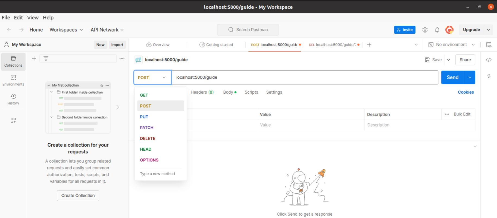<br><br>
Para testear, simplemente hay que elegir el verbo de la API y enviar a la direccion que se ponga en el recuadro, en este caso `localhost:5000/guide`, que es la del mismo ordenador. Si ha habido conexion y la API funciona correctamente, abajo en el recuadro podremos ver lo que hemos añadido/modificado/eliminado, junto con un `"Status: 200 OK"´.<br><br>
En este ejemplo, hemos solicitado ver el contenido de `localhost:5000/guides`, y hemos obtenido respuesta satisfactoria:<br><br>
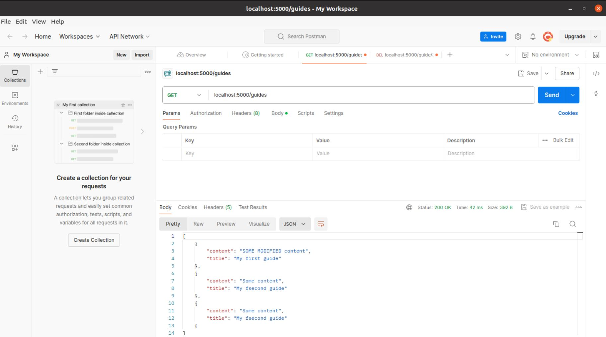

# Bases de datos
Las bases de datos, como su nombre indica, son componentes indispensables de los sistemas y aplicaciones ya que sirven de soporte de almacenamiento para poder dar respuesta a las peticiones que se reciban por parte de las APIs.

Aunque hay varios tipos de bases de datos, las más comunes que se utilizan con APIs son las siguientes:

**1. Bases de datos SQL:** Son el acrónimo de **"Structured Query Language"**, y son bases de datos relacionales que usan el lenguaje SQL para almacenar y manipular datos. Principalmente se caracterizan por ser estructuradas, organizando los datos en tablas con filas y columnas. El lenguaje SQL es el estándar para interactuar con estas bases de datos, con el fin de crear, modificar o eliminar tablas. Son bases de datos versátiles y flexibles, ideales para una amplia variedad de aplicaciones y necesidades de almacenamiento de datos.

**2. Bases de datos NoSQL:** Como su nombre indica, son **NoSQL (Not only SQL)**, son muy populares y se caracterizan porque, al contrario de las SQL, no usan tablas para organizar los datos, sino colecciones de elementos heterogéneos. En esas colecciones se pueden almacenar registros con datos distintos entre sí, y por tanto, son ideales para aplicaciones que requieren variabilidad en la información almacenada y una rápida recuperación de datos.

Las diferencias entre las bases de datos SQL y NoSQL radican principalmente en sus estructura y su funcionalidad:

|---| SQL | NoSQL |
| ---------- | --------- | ------- |
| **Estructura de datos** | Utiliza tablas con filas y columnas para almacenar datos estructurados. |Almacena datos no estructurados en documentos, sin una estructura fija de tablas. |
|**Consistencia**|Prioriza la integridad de los datos, garantizando la consistencia.|Prioriza el rápido acceso a los datos, sacrificando en ocasiones la integridad.|
|**Escalabilidad**|Escalado vertical, añadiendo más potencia al servidor.|Escalabilidad horizontal, permitiendo ampliar la capacidad de la base de datos rápidamente.

**Por tanto, las bases de datos SQL son ideales para datos estructurados que requieren consistencia, mientras que las bases de datos NoSQL son más adecuadas para datos no estructurados que necesitan escalabilidad y rapidez de acceso.**

# MongoDB
Una de las bases de datos más utilizadas actualmente es `MongoDB`.<br>
`MongoDB` es una **base de datos NoSQL**, por tanto, almacena colecciones de datos de una forma no estructurada, sin una estructura fija de tablas pero enfocándose en la velocidad del acceso a la base de datos.<br>

Los datos que almacena `MongoDB` por tanto, se almacenan en documentos flexibles en formato similar a JSON, siendo eficienteen el manejo de grandes cantidades de datos no estructurados. Como se ha descrito anteriormente, este tipo de base de datos es muy **flexible**, lo cual permite realizar numerosas tareas en aplicaciones diferentes, desde sistemas de gestion de contenidos hasta grandes aplicaciones web. Por ese motico, `MongoDB` es famosa y utlizada por empresas como eBAY y LinkedIn, entre otros. `MongoDB` es una base de datos que tiene una serie de ventajas asi como su escalabilidad, velocidad, facilidad de manejo de datos dinamicos y la capacidad de trabajar con estrucurtras de datos cambiantes sin necesidad de migrarciones complejas, lo cual hacen de ella una herramienta muy util hoy en dia.

Para poder utilizar `MongoDB`, se puede utilizar `Postman`, ya que se puede usar para probar APIs que interactúan con la base de datos `MongoDB`. En este contexto, `Postman` se usa para verificar el funcionamiento de las APIs que acceden a los datos almacenados en `MongoDB`, permitiendo probar la comunicación entre la aplicación y la base de datos.

Por otro lado, y como es de suponer, `MongoDB` tiene que instalarse al igual que la terminal de `MongoDB`, que es `mongosh`. Desde esta terminal se lanzarán los comandos para realizar operaciones de creación, actualización, supresión o consulta de datos. Cabe recordar otra vez que `MongoDB` trabaja con **documentos JSON**, lo cual significa que habrá que añadir los datos en ese formato. En cuanto a las funcionalidades mas comunes de `MongoDB`, se encuentran las siguientes:


**1. Creación de una nueva base de datos** con `use nombre_database`. <br><br>
**2. Desplegar las bases de datos** disponibles `show dbs` <br><br>
**3. Creación de un usuarios** :arrow_right: con el comando `db.createUser()` y adjuntando los datos en formato JSON.<br><br>
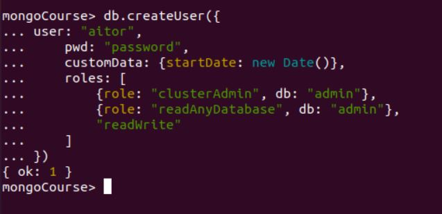<br>
En este caso se crea un usuario llamado "aitor" con demás datos, asi como contaseña, los roles, etc.<br><br>
**4. Consulta de usuarios** :arrow_right: con el comando `db.getUsers()`<br><br>
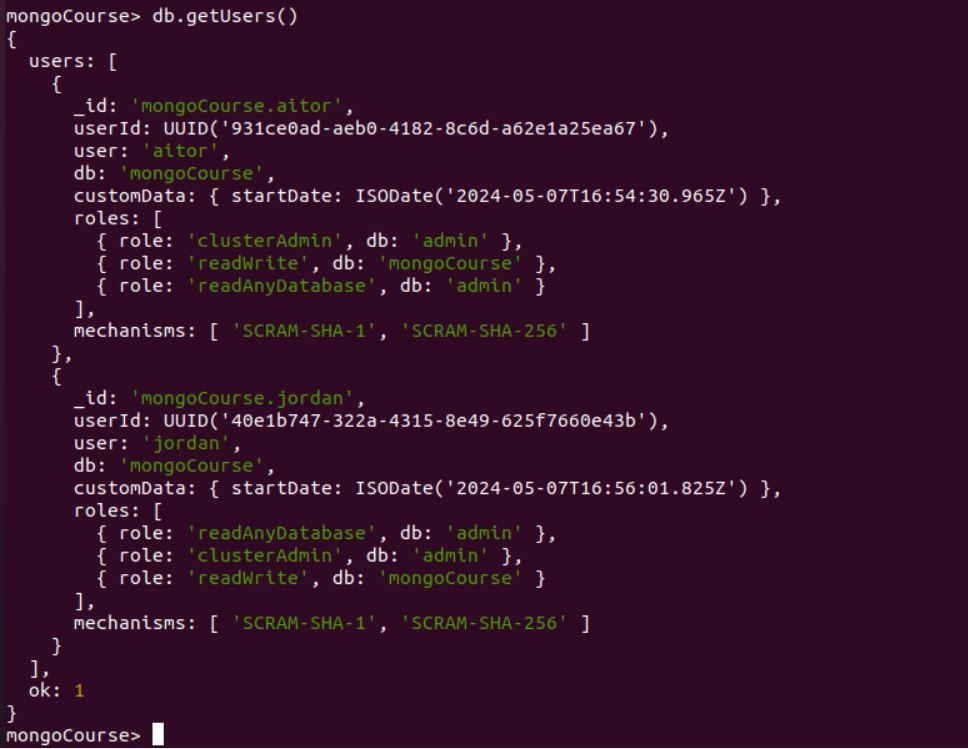<br>
Se despliegan cúantos usuarios hay en la base de datos, que serian "aitor" y "jordan". <br><br>

**5. Eliminación de usuarios** :arrow_right: con el comando `db.dropUser("usuario_a_eliminar")`<br><br>
<br>
En este caso se elimina al usuario "jordan" y se emplea `db.getUsers()`para confirmas que se ha eliminado.<br><br>

**6. Creación de colecciones** :arrow_right: con el comando `db.createCollection("nombre_de_la_nueva_coleccion")`:<br><br>
Mediante el comando `db.createCollection("books")` crea la coleccion `books`.<br><br>

**7. Ver colecciones** :arrow_right: con el comando `show collections`<br>
En nuestro caso solo hay una colección creada que es `books`.<br><br>

**8. Añadir documentos a la colección** :arrow_right: con el comando `db.books.insertOne({datos en formato JSON})` <br><br>
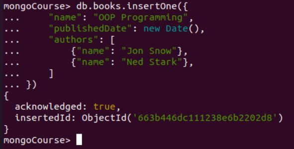<br>
Se añade el libro titulado "OOP Programming" con otros datos de autores y fecha de publiación, etc.<br>
También se pueden añadir mas de un elemento a la vez usando el comando `db.books.insertMany({datos en formato JSON})`<br>
Y obtendremos confirmación por cada elemento que se haya añadido, en este caso, si se añaden 3 elementos, obtendremos tres respuestas<br><br>
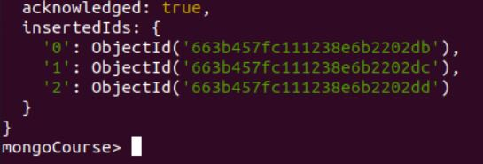<br><br>


**9. Ver documentos de la coleccion** :arrow_right: con el comando `db.nombre_coleccion.find()`. <br><br>
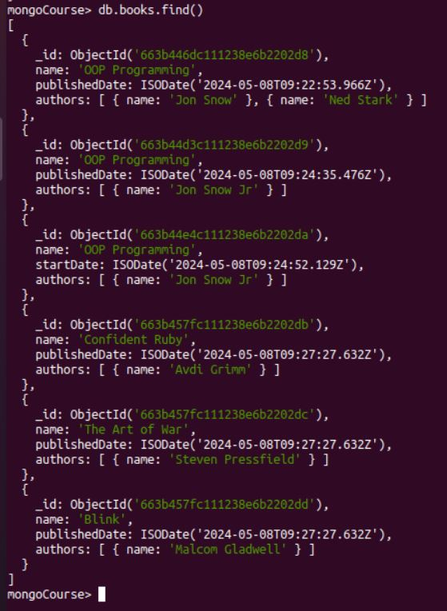<br>
En este caso se listan todos los elementos que hay en esta coleccion `books` que en total son 6 elementos (libros). <br><br>
**10. Ver documentos específicos en la colección** :arrow_right: con el comando `db.nombre_coleccion.find({datos especificos de lo que se quiere encontrar})`<br><br>
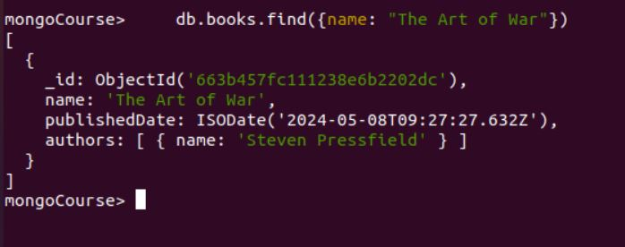<br>
Se busca por el nombre "The Art of the War", y devuelve los datos en el caso de que haya un libro que tenga ese nombre.<br><br>

**11. Ver un documento especifico** :arrow_right: con el comando `db.nombre_coleccion.findOne({datos especificos de lo que se quiere encontrar})`.<br>
Si por ejemplo tenemos dos elementos que se llaman igual, con este comando solo nos mostrará el primero de ellos.<br><br>
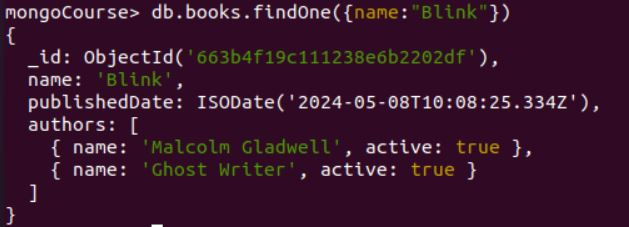<br><br>

**12. Usar las proyecciones de MongoDB**.<br>
Las proyecciones en MogoDB es una forma de filtrar los datos que una base de datos nos devuelve.<br>
Por ejemplo, vamos a filtrar datos en base al `nombre`, la `fecha de publicación`y los `autores`. Para poder filtrarlo usamos el número `1` para que lo muestre o `0` para que no lo muestre.<br><br>
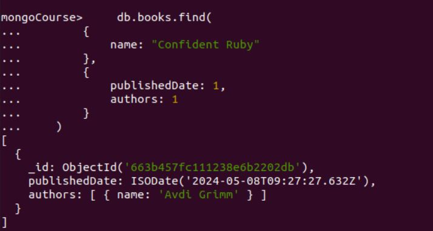<br>
Aquí se nos muestran los datos solicitados y filtrados.<br><br>
Por otra parte, podemos usar una sintaxis mas avanzada para buscar datos usando un comando muy parecido al anterior `db.nombre_coleccion.findOne({name: /.*palabras clave.*/i})`.<br>
En este caso vamos a emplear el comando `db.books.findOne({name: /.*deep work.*/i})`, que basicamente es filtrar por el nombre, y ese nombre tiene que tener "deep work" en su interior. Además se pone la letra `i` después para que de ese modo no haga distincion entre mayúsculas y  minúsculas y busque de una forma mas amplia.<br><br>
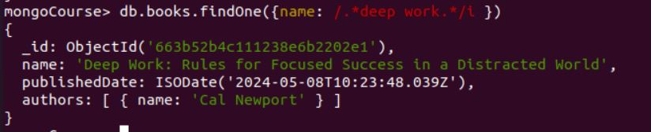<br>

**13. Selección de arrays anidados** usando `$slice`<br>
Se utiliza en el caso de que tengamos un documento que tenga un apartdo con 2 objetos, cada uno con un atributo con el mismo nombre. El objetivo es acceder a este documento dejando fuera al segundo autor:<br>
```python
db.books.insertOne({
    "name": "Blink",
    "publishedDate": new Date(),
    "authors": [
        {"name": "Malcolm Gladwell"},
        {"name": "Ghost Writer"},
    ]
})
```
Por tanto se filtra de este modo:
```python
db.books.find(
    {
        name: "Blink"
    },
    {
        publishedDate: 1,
        name: 1,
        authors: {
            $slice: 1
        }
    }
)
```
En el que primero usamos `authors` como filtro y luego le pasamos un objeto con el atributo `$slice`y el valor `1`para indicar que solo queremos el primer elemento del array.<br>

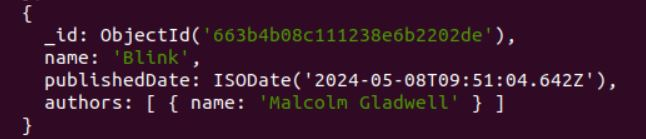<br>


Si por el contrario, queremos que nos muestre los dos primeros elementos del array, aplicariamos el número `2`.<br>

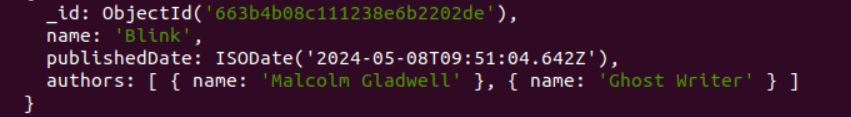<br>


Finlamente, si solo queremos que nos devuelva el último, pondriamos `-1`. <br>

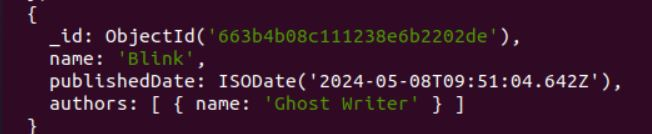<br>


**14. Colecciones anidadas**<br>
Primero se añade un elemento:
```python
db.books.insertOne({
    "name": "Blink",
    "publishedDate": new Date(),
    "authors": [
        {"name": "Malcolm Gladwell", "active": true},
        {"name": "Ghost Writer", "active": true},
    ]
});
```
y escribimos lo siguiente para obtener el nombre del autor sin que nos indique si esta activo o no.
```python
db.books.find(
    {
        name: "Blink"
    },
    {
        name: 1,
        publishedDate: 1,
        "authors.name": 1
    }
)
```
`Authors` en un array de objetos y queremos que nos devuelva el atributo `name` de cada uno de ellos.<br>
Se selecciona el atributo `name` de `authors` y para ello tenemos que poner la anotación de un punto `.`.<br><br>
**El resultado es:**<br>
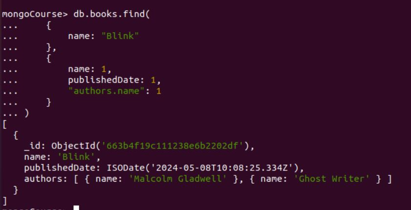

**15. Ver si un documento existe en la colección o no** :arrow_right: con el comando `db.nombre_coleccion({nombre: {$exists: true/false})`<br><br>
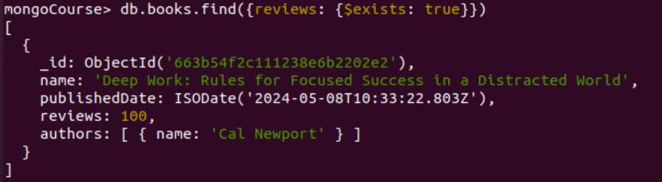<br>
En este caso aplicamos `db.books.find({reviews: {$exists: true}})` y nos devuelve lo que se ve en la imagen. Si nos devuelve datos se sobreentiende que existe.<br><br>

**16. Eliminar documentos** <br>
Para eliminar datos se aplica :arrow_right: el comando `db.nombre_coleecion.remove({datos especificos de lo que se quiere borrar})`<br>
Para eliminar todos los items que tienen por nombre "OOP Programming" se emplea :arrow_right: `db.books.remove({name: "OOP Programming"})`<br>
Para eliminar un item que tenga por nombre "OOP Programming" se emplea :arrow_right: `db.books.remove({name: "OOP Programming"}, 1)`<br>

