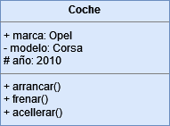
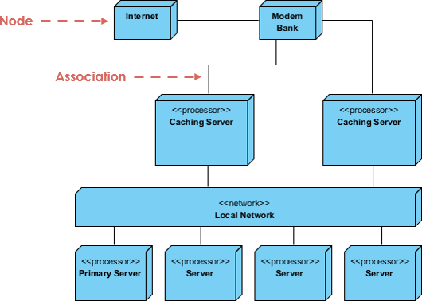
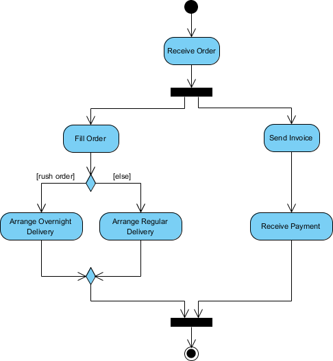

# CheckPoint 13

## Diagrama de clases - Definición y componentes

Un diagrama de clases es un tipo de diagrama estructural, y principal ente se utilizan para modelar la estructura de un sistema, incluyendo sus clases, atributos, métodos y relaciones entre ellos.
Un diagrama de clases consta de los siguientes elementos principales; Clases y Relaciones.

### CLASES 
Por un lado, las clases son los bloques de construcción fundamentales de un diagrama de clases. Se representan como rectángulos divididos en tres secciones:  
**1.	Nombre de la clase:** En la parte superior, en negrita y mayúsculas. 
**2.	Atributos:** En la sección media, describen las características de la clase. 
**3.	Métodos:** En la sección inferior, representan las acciones que la clase puede realizar. 

**Visibilidad**
Símbolos que indican el nivel de acceso a los atributos y métodos: 
- "+" para público.
- "-" para privado.
- "#" para protegido.

Por ejemplo, una clase "Coche" podría tener:  
- Nombre: COCHE 
- Atributos: marca, modelo, año 
- Métodos: arrancar(), frenar(), acelerar() 

### RELACIONES 
Las relaciones muestran cómo las clases interactúan entre sí. Las principales son:   
**1.	Asociación:** Representa una conexión estructural y puede ser unidireccional o bidireccional. Por ejemplo, en un diagrama de clases de un sistema de ventas, puede haber una asociación entre las clases "Cliente" y "Producto", indicando que un cliente puede comprar varios productos.  
**2.	Multiplicidad:** Es una propiedad de una asociación que indica cuántos objetos de una clase están relacionados con un objeto de la otra clase. Se representa mediante un número o un rango de números. Por ejemplo, en una asociación entre las clases "Cliente" y "Producto", la multiplicidad puede indicar que un cliente puede comprar de 0 a muchos productos.  
**3.	Navegabilidad:** Es una propiedad de una asociación que indica si un objeto de una clase puede acceder directamente a los objetos de la otra clase a través de la asociación. Se representa mediante una flecha en el diagrama de clases. Por ejemplo, en una asociación entre las clases "Cliente" y "Producto", si la navegabilidad está presente en el lado del cliente, significa que un cliente puede acceder directamente a los productos que ha comprado.  
Los diagramas de clases son beneficiosos porque: 
- Proporcionan una visión clara de la estructura del sistema. 
- Facilitan la comunicación entre desarrolladores. 
- Ayudan a identificar posibles problemas de diseño antes de la implementación. 

## Diagramas de implementación (Deployment diagrams) - Propósitos, beneficios y usos 
Los diagramas de implementación, o también conocidos como “Deployment Diagrams” son diagramas estructurales. 
Principalmente, los diagramas de implementación se utilizan para representar la arquitectura física de un sistema, incluyendo los nodos, componentes y sus relaciones.
Como tienen en común los diagramas estructurales, los diagramas de implementación se centran en la organización estática del sistema. 
### Propósito y función de los diagramas de implementación: 
- Muestran la estructura del sistema de tiempo de ejecución.
- Capturan el hardware que se utilizará para implementar el sistema y los enlaces entre diferentes elementos de hardware.
- Modelan los elementos de hardware físico y las vías de comunicación entre ellos
- Se pueden utilizar para planificar la arquitectura de un sistema.
- También son útiles para Documentar la implementación de componentes de software o nodos.  
Entre los beneficios del uso de diagramas de implementación están: 
- Visualizan la distribución física de los componentes del sistema.
- Ayudan a planificar la infraestructura necesaria.
- Facilitan la identificación de posibles cuellos de botella en el rendimiento.

  

 

Este ejemplo es un ejemplo muy simple del diagrama de implementación, en el que se muestra la estructura de un sistema. Hay diferentes nodos (cajas 3D), dentro de los nodos se pueden encontrar los artefactos entre <<>>. Por otro lado, estan las asociaciones que se decriben con líneas rectas, para indicar las relaciones entre los diferentes nodos del sistema. Es asi, como se explica mediante un diagrama de implementación, el uso de la banca online, en el que se entra por mediación de Internet y qué elementos se usan para utilizarlo. 

## Diagrama de actividades 
Un diagrama de actividades en UML es una representación gráifca que muestra un flujo de actividades o acciones en un proceso o procedimiento. Es considerado un diagrama de comportamiento, mostrando las acciones que se realizan y cómo se relacionan entre si.  
De forma específica, los diagramas de actividades muestran el flujo de control o de objetos con énfasis en la secuencia y las condiciones del flujo, proporcionando la posibilidad de fraccionar en parte más pequeñas y manejables. Se pueden usar como boceto inicial para tener una idea de cómo continuar con el desarrollo de un sistema. Sus componentes son “Estado Inicial”, “Estado de Actividad”, “Flujo de Acción”, “Estado de Decisión”, “Condiciones” y “Estado Final”. 
### Elementos clave de un diagrama de actividades:  
**1.	Nodos de acción:** Representan tareas individuales. 
**2.	Nodos de decisión:** Muestran puntos de bifurcación en el flujo. 
**3.	Nodos de inicio y fin:** Indican dónde comienza y termina el proceso. 
**4.	Flujos de control:** Conectan las actividades y muestran el orden de ejecución. 
Un ejemplo de uso de los diagramas de actividad es el siguiente de a continuación, en el que se expone el proceso de compra online:

  

 
**(Estado Inicial)** ➡️ Una vez recibido el pedido **(Nodo de acción)**, las actividades se dividen en dos conjuntos paralelos de actividades. Un lado llena y envía el pedido mientras que el otro se encarga de la facturación.
En el lado de la orden de “llenado”, el método de entrega se decide condicionalmente **(Nodo de decisión)**. Dependiendo de la condición, se realiza la actividad de entrega nocturna o la actividad de entrega regular. Finalmente las actividades paralelas se combinan para cerrar el orden **(Estado Final)**.

Por otro lado, los diagramas de actividad se pueden utilizar para visualizar y modelar carios tipos de procesos, como por ejemplo: 
- Procesos empresariales.
- Viajes de clientes.
- Procesos de venta.
- Lógica de Algoritmo.
- Elementos de arquitectura de software.
- Progreso del flujo de trabajo.

## Diseño del sistema en el proceso de desarrollo 
El diseño del sistema es crucial para el proceso de desarrollo, ya que tiene un impacto muy significativo por varias razones:   
**1.	Planificación efectiva:** Proporciona una hoja de ruta clara para el desarrollo, reduciendo la incertidumbre y los riesgos.  
**2.	Optimización de recursos:** Ayuda a identificar y asignar eficientemente los recursos necesarios para el proyecto.  
**3.	Detección temprana de problemas:** Permite identificar y resolver problemas potenciales antes de que se conviertan en costosos errores durante la implementación.  
**4.	Mejora de la calidad:** Un buen diseño conduce a un código más limpio, modular y mantenible.  
**5.	Facilita la colaboración:** Proporciona una visión compartida del sistema entre todos los miembros del equipo.  
**6.	Documentación:** Actúan como documentación visual del sistema, útil para el mantenimiento y modificaciones futuras. 
**7.	Traceabilidad:** Permiten el seguimiento de cómo los requisitos se traducen en componentes de diseño y luego en código. 
**8.	Reutilizabilidad:** Facilitan la identificación de componentes reutilizables, promoviendo la eficiencia en el desarrollo. 
**9.	Gestión de la complejidad:** Ayudan a descompuestos sistemas complejos en partes manejables.  
En resumen, el diseño de sistema es **fundamental** para el proceso de desarrollo, siendo muy útiles por la gran cantidad de beneficios que aportan.
