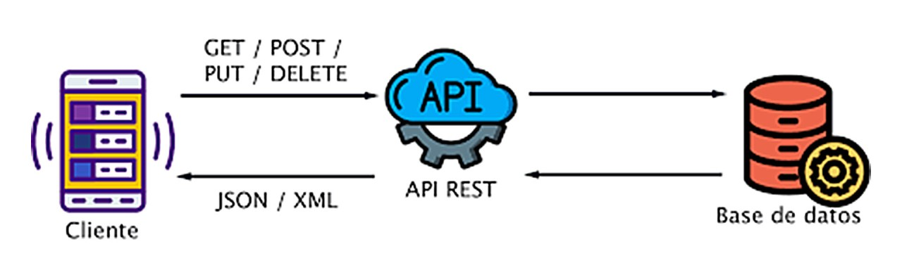
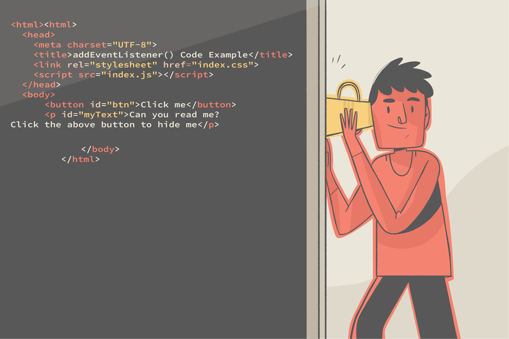

# CheckPoint 15

## AXIOS
Axios es una popular librería de JavaScript utilizada para realizar solicitudes HTTP desde el navegador o desde un entorno Node.js. Muchos proyectos en la web necesitan interactuar con una API REST en algún momento de su desarrollo, y axios nos brinda una interfaz sencilla y potente para interactuar con APIs y servicios web.
<p align="center">
  
</p>
### Las principales características de axios son las siguientes:
**1.	Es un cliente HTTP basado en promesas:** Axios utiliza promesas de JavaScript, lo que facilita el manejo de operaciones asincrónicas y permite escribir código más limpio y legible.<br/>
**2.	Compatibilidad:** Funciona tanto en el navegador como en Node.js, lo que permite utilizarlo en una amplia gama de proyectos.<br/>
**3.	Transformación automática de datos:** Axios puede transformar automáticamente los datos de respuesta en formato JSON, ahorrando tiempo y esfuerzo al desarrollador.<br/>
**4.	Interceptores:** Permite interceptar y modificar solicitudes y respuestas antes de que sean manejadas por `then` o `catch`. 

### Beneficios de uso
Debido a las características de axios, el uso de esta librería es muy amplia y sencilla, aportando numerosos beneficios a los desarrolladores.<br/> 
Entre los beneficios de usar Axios, destacan los siguientes:<br/>
**1.	Sintaxis simple** ➡️Axios ofrece una API más intuitiva en comparación con otras alternativas como `Fetch`. <br/>
**2.	Manejo de errores mejorado** ➡️Proporciona un manejo de errores más robusto y consistente, facilitando la detección y gestión de problemas en las solicitudes. <br/>
**3.	Cancelación de solicitudes**➡️ Permite cancelar solicitudes en curso, lo cual es útil para optimizar el rendimiento y evitar operaciones innecesarias. <br/>
**4.	Configuración global** ➡️Ofrece la posibilidad de establecer configuraciones por defecto para todas las solicitudes, lo que simplifica la gestión de opciones comunes. <br/>
**5.	Transformación de datos** ➡️ Facilita la manipulación y transformación de datos tanto en las solicitudes como en las respuestas.<br/>
### Usos de axios
Axios es especialmente útil en las siguientes situaciones: <br/>
**1.	Desarrollo de aplicaciones web modernas:** Es ideal para proyectos que requieren interacción frecuente con APIs RESTful.  <br/>
**2.	Aplicaciones React o Angular:** Se integra perfectamente con estos frameworks, facilitando la gestión de estado y la actualización de componentes basada en datos de API. <br/>
**3.	Proyectos Node.js:** Cuando necesitas realizar solicitudes HTTP desde el lado del servidor. <br/>
**4.	Aplicaciones que requieren cancelación de solicitudes:** En situaciones donde necesitas cancelar solicitudes pendientes, como en búsquedas en tiempo real o cargas de archivos interrumpibles. <br/>
**5.	Escenarios de autenticación complejos:** Axios simplifica la implementación de flujos de autenticación y renovación de tokens. 
<br/>
Para usar axios es fundamental tenerlo instalado mediante el siguiente comando:
```javascript
npm install axios
```
Además de ello, para poder utilizarlo hay que importarlo en el archivo que se quiere utilizarlo. 
```javascript
import axios from 'axios';
```
Tras ello, se pueden realizar diferentes peticiones HTTP usando los métodos de Axios, como por ejemplo, una petición GET:
```javascript
const [data, setData] = useState(null);

useEffect(() => {
  axios.get('https://api.example.com/data')
    .then(response => {
      setData(response.data);
    })
    .catch(error => {
      console.error('Error:', error);
    });
}, []);
```
### Desglosando el codigo paso a paso:

```javascript
const [data, setData] = useState(null);
```
**1. PASO**<br/>
Esta línea utiliza el hook useState para crear una variable de estado llamada data y una función setData para actualizarla. Inicialmente, data se establece como null.
```javascript
useEffect(() => {
  // ... código dentro del efecto
}, [])
```
**2. PASO**<br/>
El hook useEffect se utiliza para ejecutar efectos secundarios en componentes funcionales. En este caso, se usa para realizar la petición HTTP cuando el componente se monta. 
```javascript
axios.get('https://api.example.com/data')
```
**3. PASO**<br/>
Esta línea realiza una petición GET a la URL especificada utilizando Axios1
```javascript
.then(response => {
  setData(response.data);
})
```
**4. PASO**<br/>
Si la petición es exitosa, se ejecuta esta función. response.data contiene los datos devueltos por la API, que se guardan en el estado data usando setData. 
```javascript
.catch(error => {
  console.error('Error:', error);
});
```
**5. PASO**<br/>
Si ocurre un error durante la petición, se captura y se registra en la consola. 

```javascript
}, [])
```
**6. PASO**<br/>
El array vacío como segundo argumento de useEffect indica que este efecto solo debe ejecutarse una vez, cuando el componente se monta. <br/><br/>
**En resumen, Axios es una herramienta versátil y potente que simplifica significativamente el proceso de realizar solicitudes HTTP en aplicaciones JavaScript. Su facilidad de uso, robustez y características avanzadas la convierten en una excelente opción para una amplia gama de proyectos de desarrollo web y de aplicaciones.**

## ReactDevTools - ¿Qué son y para qué se usan?
<p align="center">
  
</p>

Primero de todo tenemos que partir de que la **depuración es una parte muy importante** del desarrollo de software. Esto, permite detectar errores en el código de forma temprana y ser más eficiente.<br/>
React es una de las bibliotecas de front-end que permite interfaces de usuario complejas e interactivas, dando la opción a los desarrolladores de utilizar un conjunto de herramientas para la depuración, llamadas **React DevTools**.<br/>
Las ReactDevTools son una extensión de navegador que permite inspeccionar la jerarquía de componentes de React en las herramientas des desarrollador del navegador que se esté utilizando. Estas herramientas proporcionan unos widgets de inspección para ayudar en el desarrollo y depuración.
<br/>
### Uso de ReactDevTools
Entre otras, las ReactDevTools nos permiten hacer las siguientes acciones:<br/>
- Inspección de componentes
  - Permite ver la estructura jerárquica de componentes React en una aplicación.
  - Muestra los props y el estado de cada componente, facilitando la depuración.
  - Permite seleccionar componentes en la página y verlos resaltados en la estructura de árbol.
- Edición en tiempo real
  - Permite editar props y estado de los componentes directamente desde la herramienta, viendo los cambios reflejados inmediatamente en la interfaz.
- Análisis de rendimiento
  -  Incluye un Profiler para registrar y analizar el rendimiento de la renderización de componentes.
  -  Ayuda a identificar cuellos de botella y optimizar el rendimiento.
- Depuración
  - Facilita encontrar problemas al poder inspeccionar la estructura interna de la aplicación React.
  - Permite ver cómo fluyen los datos entre componentes.
- Desarrollo más rápido
  - Acelera el proceso de desarrollo al proporcionar una visión clara de la estructura y estado de la aplicación.
  - Ayuda a ubicar rápidamente componentes y entender su funcionamiento.

<p align="center">
  
</p>

**En resumen, React Developer Tools mejora significativamente la experiencia de desarrollo con React al proporcionar herramientas poderosas para inspeccionar, depurar y optimizar aplicaciones React directamente desde el navegador.**


## Event Listeners o "oyente de eventos" - ¿Qué son y qué beneficios tiene su uso?

Un event listener es una función que se encarga de escuchar y responder a eventos específicos que ocurren en elementos del DOM o en objetos de JavaScript. 
En el marco de uso con React, es una función que se ejecuta en respuesta a un evento específico, como un clic de botón o un cambio en un campo de entrada. Los event listeners permiten que las aplicaciones React respondan a las interacciones del usuario, haciendo que la interfaz sea dinámica e interactiva.

<p align="center">
  
</p>

### Centrándonos en el uso de EventListeners en React, el uso de EventListener aporta numerosos beneficios, entre ellos:

**Interactividad mejorada**<br/>
Los event listeners permiten crear interfaces de usuario altamente interactivas, respondiendo a las acciones del usuario en tiempo real.<br/>
**Sintaxis simplificada**<br/>
React proporciona una sintaxis simplificada para agregar event listeners, utilizando propiedades especiales en los elementos JSX.<br/>
**Rendimiento optimizado**<br/>
React utiliza un sistema de eventos que mejora el rendimiento y garantiza la compatibilidad entre navegadores.<br/>
**Manejo centralizado de eventos**<br/>
Los event listeners en React permiten manejar eventos de manera centralizada, lo que facilita la gestión y el mantenimiento del código.<br/>

#### Para entender mejor el uso, se exponen una serie de ejemplos a continuación:

--- 

 **Ejemplo 1:** Manejo de clics en un botón.
 ```javascript
function Button() {
  const handleClick = () => {
    console.log('Botón clickeado');
  };

  return <button onClick={handleClick}>Haz clic</button>;
}
```
 En este ejemplo, el event listener handleClick se ejecuta cuando se hace clic en el botón.
 
---

**Ejemplo 2:** Manejo de cambios en un campo de entrada 
```javascript
function InputField() {
  const [value, setValue] = useState('');

  const handleChange = (event) => {
    setValue(event.target.value);
  };

  return <input type="text" value={value} onChange={handleChange} />;
}
```
Aquí, el event listener handleChange se activa cada vez que el usuario escribe en el campo de entrada, actualizando el estado del componente.

---

**Ejemplo 3:** Manejo de eventos del teclado 
```javascript
function KeyboardListener() {
  useEffect(() => {
    const handleKeyDown = (event) => {
      if (event.key === 'Escape') {
        console.log('Tecla Escape presionada');
      }
    };

    document.addEventListener('keydown', handleKeyDown);

    return () => {
      document.removeEventListener('keydown', handleKeyDown);
    };
  }, []);

  return <div>Presiona la tecla Escape</div>;
}

```
 Este ejemplo muestra cómo agregar un event listener para eventos del teclado utilizando el hook useEffect. El listener se agrega cuando el componente se monta y se elimina cuando se desmonta, evitando fugas de memoria.

---
 
**En resumen, los event listeners en React son fundamentales para crear aplicaciones interactivas y receptivas. Proporcionan una forma eficiente y declarativa de manejar las interacciones del usuario, mejorando la experiencia general de la aplicación.**


