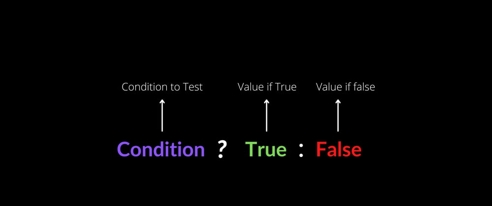

# CheckPoint 17
## CRUD

CRUD es un acrónimo que representa las cuatro operaciones fundamentales en la gestión de datos; que son Create (Crear), Read (Leer), Update (Actualizar) y Delete (Eliminar). En el contexto de desarrollo web, estas operaciones son fundamentales para cualquier sistema que requiera interactuar con una base de datos, permitiendo a los usuarios añadir, visualizar, modificar o eliminar información.

<p align="center">
  
</p>

Al implementar estas operaciones CRUD, los desarrolladores de software pueden proporcionar una experiencia de usuario intuitiva y fluida que les permita interactuar sin problemas con los datos subyacentes. La implementación de operaciones CRUD a menudo depende de una base de datos SQL o NoSQL, o una API RESTful como hemos visto en las últimas guías.


### Beneficios de CRUD

1.	Estandarización: proporciona un sistema que es común a todos para gestionar datos, facilitando la integración y comunicación entre aplicaciones.
2.	Automatización: las operaciones CRUD pueden automatizarse, siendo no necesario actualizarlas manualmente.
3.	Escalabilidad: Facilita que los sistemas pueden crecer, ya que el manejo de datos sigue siendo relativamente fácil.
4.	Simplicidad: el enfoque que usan es claro y directo, siendo útil para todos los desarrolladores tanto junior como senior.
5.	Compatibilidad: las operaciones CRUD son aplicables a una variedad de tecnologías, así como bases de datos SQL, NoSQL, API RESTful, etc. Esto hace que sean muy versátiles y se puedan usar mas fácilmente.

### ¿Cúando y por qué usar CRUD?

CRUD se usa siempre y cuando se necesite manipular datos. Es decir, siempre que tengamos que añadir, eliminar, actualizar o eliminar datos estaremos haciendo uso de CRUD.<br/>
Por ejemplo, poniendo ejemplos del día a día, CRUD se usa para el desarrollo de aplicaciones web, en el que se necesita gestionar contenido, usuarios, los productos, etc. Otro claro ejemplo puede ser en las aplicaciones móviles cuando se sincronizan datos entre dispositivos móviles y servidores, como es el caso de la copia de seguridad de WhatsApp a Google Drive para no perder tus conversaciones.<br/>
Haciendo mas hincapié en el uso de CRUD, utilizaré ejemplos cotidianos para entenderlo mejor.<br/>
#### Ejemplo 1 – Uso de CRUD en una red social como Instagram.
Aquí el uso de CRUD es indispensable, realizando las siguientes tareas:<br/>
-	Create ➡️  Se usaría para crear una nueva publicación/story/video.
-	Read ➡️  Se usaría para ver el contenido (foto, video, etc) de una cuenta a quien sigues. Incluso se usaría Read para simplemente ver el perfil de esa persona/cuenta.
-	Update ➡️ Se usaría para editar información de tu perfil, o modificar la descripción de una foto/video que has colgado recientemente.
-	Delete ➡️  como su nombre indica, se usaría para borrar un elemento, un comentario, una publicación, etc.

#### Ejemplo 2 -  Uso de CRUD para gestionar el inventario de una tienda de muebles.<br/>
-	Create ➡️ se usaría para añadir un nuevo tipo de mueble al inventario.
-	Update ➡️  se usaría para actualizar la cantidad de muebles disponible, el color, modificar las características o la descripción del mismo, etc.
-	Read ➡️  Se usaría para ver el mueble, para consultar la disponibilidad, ver el precio y tiempo de envío, etc.
-	Delete ➡️  Se usaría para eliminar un producto, bien porque no queda stock y no se pretende traer mas, o porque está actualmente descatalogado. 

 En todos casos, CRUD proporciona una estructura clara, sencilla y eficiente para manejar datos, dando opción a los desarrolladores a crear aplicaciones más intuitivas, escalables y mantenibles, y también de este modo, proporcionan una experiencia de usuario mejor. 


## Operador Ternario
Un operador ternario es una estructura condicional que permite evaluar una condición y devolver uno de dos valores posibles en una sola línea de código. Es una forma abreviada y mas simple de escribir una declaración if-else simple.

<p align="center">
  
</p>

La sintaxis general de un operador ternario es:
```javascript
condición ? valorSiVerdadero : valorSiFalso
```` 
Donde:<br/>
**condición**: es la expresión que se evalúa como verdadera o falsa. <br/>
**valorSiVerdadero**: es el valor que se devuelve si la condición es verdadera. <br/>
**valorSiFalso**: es el valor que se devuelve si la condición es falsa.  <br/>


El uso de operadores ternarios trae beneficios. Al ser un un código más simple y conciso, permite expresar una lógica condicional simple en una sola línea. Además, contribuyen a la legibilidad del código, ya que hacen que sea el código más fácil para leer uy entender. A parte de esto, al ser una expresión mas compacta, puede ligeramente ser más eficiente para el rendimiento del sistema. <br/><br/>
Aun así, los operadores ternarios son mas adecuados cuando se quieren hacer condicionales simples, así como evaluar una condición sencilla y devolver uno de los dos valores posibles, o también para el retorno de funciones, cuando una función necesita devolver uno de dos valores basados en una condición. <br/>

Para entenderlo mejor, se exponen ejemplos del uso de operadores ternarios a continuación: <br/>
#### Ejemplo 1 – Hacer descuento
En una pagina web, queremos aplicar un descuento a un cliente fiel, antiguo, o que se haya gastado bastante dinero en el último año.
```javascript
let precioTotal;

if (clienteFiel) {
    precioTotal = precioProducto * 0.85;
} else {
    precioTotal = precioProducto;
}
```
Este seria realizando una declaración if else, como hemos aprendido hasta ahora. Mediante el uso de operadores ternarios hemos simplificado y hecho más conciso el condicional:
```javascript
const precioTotal = clienteFiel ¿ precioProducto * 0.85 : precioProducto;
```
siendo precioProducto el precio del producto/carrito y precioTotal, el precio final una vez evaluado si es un cliente fiel/antiguo o no.
De este modo, para calcular precioTotal, se evalua si el cliente es clienteFiel. Si lo es, se ejecuta la primera parte, lo cual se le hace un descuento del 15%, si no se cumple, el cliente paga el valor del producto.

#### Ejemplo 2 – Saludo a usuario registrado

```javascript
const saludoInicial = usuarioRegistrado ¿ “Bienvenido ${nombreUsuario}!” : “Bienvenido invitado!” ;
```
Si no usásemos el operador ternario seria del siguiente modo:
```javascript
let saludoInicial;

if (usuarioRegistrado) {
    saludoInicial = `Bienvenido ${nombreUsuario}!`;
} else {
    saludoInicial = "Bienvenido invitado!";
}
```
Seria un código que nos llevaría al mismo resultado, pero es mas extenso…

#### Ejemplo 3 - Manejo de permisos
```javascript
const accionPermitida = usuario.esAdmin ? 'Acceso total' : 'Acceso limitado';
```
Igualmente, con el último ejemplo, en el que podemos llegar a la mismo conclusión usando una declaración if else, pero sería más adecuado el uso de operadores ternarios para simplificar el condicional.
```javascript
let accionPermitida;

if (usuario.esAdmin) {
    accionPermitida = 'Acceso total';
} else {
    accionPermitida = 'Acceso limitado';
}

```

Es importante recordar que, aunque los operadores ternarios son útiles, no deben abusarse. Se usan principalmente para condiciones simples, por el contrario, para condiciones más complejas o cuando se requiere más de una operación, es preferible utilizar declaraciones if-else tradicionales para mantener la claridad del código.


## ¿Qué tipo de solicitud de API hacemos cuando queremos eliminar datos?

Como comentamos en el checkpoint 12 (https://github.com/aatxaerandio/DevCamp/blob/ee32f0560136bcc639c53379765266f1aa9a8868/Full-Stack/module_06_git_%26_github/CheckPotin_12.md) , las rutas HTTP se asocian a un verbo como GET, PUT, POST o DELETE.

En el caso de las solicitudes de API para eliminar datos, esta es una solicitud DELETE. En el caso de API, y usando la librería axios, si se usa DELETE, este envía una solicitud HTPP DELETE a la api que estemos utilizando en cuestión y recibe un mensaje de vuelta. 

Partimos de la base de un codigo con un ciclo de vida en un componenete de React, especificamente `componentDidMount()` que se ejecuta automaticamente después de que un componente dse monta en el DOM. 

#### En el siguiente ejemplo:
```javascript
componentDidMount() {
    axios.delete('https://api_ejemplo/api/posts/1')
        .then(() => this.setState({ status: 'Delete successful' }));
}
```
Cuando se recibe la respuesta, el componente React muestra el mensaje de estado 'Eliminar correctamente'.</br>
Usar DELETE es simple, directo y claro para eliminar datos. Además, y tal y como hemos comentado, forma parte de la arquitectura REST, lo que facilita la interoperabilidad.

DELETE se usa en diversas situaciones donde es necesario eliminar datos, así como, eliminar un post/foto/video de una red social, quitar un producto de un catalogo de tienda, eliminar una cuenta de un usuario, o simplemente eliminar un archivo en un sistema de almacenamiento.</br>
#### Ejemplo de uso de DELETE:</br>
Eliminar un post en Instagram.</br>
```javascript
componentDidMount() {
    // Simple DELETE request with axios
    axios.delete('https://api.instagram.com/v1/media/1')
        .then(() => this.setState({ status: 'Delete successful' }))
        .catch(error => {
            console.error('Error al eliminar:', error);
            this.setState({ status: 'Error en la eliminación' });
        });
}
```
Se utiliza la biblioteca `axios` para hacer una solicitud HTTP DELETE a la URL especificada `(https://api.instagram.com/v1/media/1)` para eliminar un recurso específico (en este caso, un medio de Instagram con ID 1).</br> </br>
Si la solicitud DELETE es exitosa, se ejecuta la función `then(...)`. Aquí, se actualiza el estado del componente con `this.setState({ status: 'Delete successful' })`, lo que informará al usuario que la eliminación fue exitosa. </br> </br>
Si ocurre un error durante la solicitud, se ejecuta el siguiente bloque `.catch(error => {...}):`. Se imprime el error en la consola con `console.error(...)`, y se actualiza el estado del componente para reflejar que hubo un problema: `this.setState({ status: 'Error en la eliminación' })`.


## ¿Qué tipo de solicitud de API hacemos cuando queremos actualizar los datos?

En el caso de que queramos actualizar los datos, la solicitud de API que se utiliza es generalmente una solicitud HTTP PUT o PATCH. 

La solicitud PUT se usa para reemplazar completamente un recurso, y de este modo asegura que el recurso esté presente en el sistema, es decir, evita problemas de consistencia (ya que sería eliminar un recurso e implementar otro).

Por otro lado esta PATCH, que permite actualizar solo los campos específicos que necesitan los cambios, y es más eficiente que enviar todos los datos del recurso. Este último se usa para pequeñas modificaciones y específicas.

Partimos de la base que queremos modificar datos en un servidor. Usando PUT en axios, seria de la siguiente manera:

```javascript
componentDidMount() {
    const article = { title: 'React PUT Request Example' };
    axios.put('https://url_ejemplo/api/articles/1', article)
        .then(response => this.setState({ updatedAt: response.data.updatedAt }))
        .catch(error => {
            console.error('Error en la solicitud PUT:', error);
        });
}

```

Se crea un objeto llamado article con una propiedad title. Este objeto representa los datos que se enviarán en la solicitud PUT.

Se utiliza Axios para realizar una solicitud PUT a la URL `https://url_ejemplo/api/articles/1`. El segundo argumento de `axios.put()` es el objeto `article` que se enviará como cuerpo de la solicitud.

Axios devuelve una promesa. Cuando la solicitud se completa con éxito, se ejecuta la función de callback en el método `then()`. Esta función toma la respuesta del servidor y actualiza el estado del componente con el valor de `updatedAt` de la respuesta.

En ambos casos, la elección entre PATCH y PUT dependerá de lo que necesites realizar. PATCH es generalmente para actualizaciones parciales, mientras que PUT se usa para reemplazos completos.

## Código Dinámico

El código dinámico se refiere al código que se ejecuta en respuesta a eventos o acciones específicas y puede cambiarse o adaptarse según las condiciones o datos en tiempo real. Esta característica ofrece una gran flexibilidad y potencia a las aplicaciones React. 
Es decir, en ligar de ser in código estático y siempre producir el mismo resultado, el código dinámico puede generar diferentes resultados basadas en entradas variables, interacciones del usuario, etc.
En el mundo del desarrollo web, esto se traduce en páginas que cambian su contenido o comportamiento según las interacciones del usuario o datos que provienen de una base de datos.

Para entenderlo mejor, se expone un ejemplo para explicar el uso del código dinámico para cargar componentes. Partimos de la base en el que en un proyecto React tenemos un componente que se llama `AñadirPersona.js`.

En este paso, utilizará Axios con otro método de solicitud HTTP denominado POST.

Dentro del proyecto de React, necesitarás crear un nuevo componente llamado `AñadirPersona.js`.

Se crea `AñadirPerdona.js` y se agrega el siguiente código para crear un formulario que permita la entrada del usuario y, posteriormente, publique el contenido en una API:

src/components/AñadirPersona.js

```javascript
import React from 'react';
import axios from 'axios';

export default class AñadirPersona extends React.Component {
  state = {
    name: ''
  }

  handleChange = event => {
    this.setState({ name: event.target.value });
  }

  handleSubmit = event => {
    event.preventDefault();

    const user = {
      name: this.state.name
    };

    axios.post(`https://jsonplaceholder.typicode.com/users`, { user })
      .then(res => {
        console.log(res);
        console.log(res.data);
      })
  }

  render() {
    return (
      <div>
        <form onSubmit={this.handleSubmit}>
          <label>
            Person Name:
            <input type="text" name="name" onChange={this.handleChange} />
          </label>
          <button type="submit">Add</button>
        </form>
      </div>
    )
  }
}
```


Dentro de la función handleSubmit, se impide la acción predeterminada del formulario. A continuación, actualice el estado a la entrada del usuario.

El uso de POST le proporciona el mismo objeto de respuesta con información que puede usar dentro de una llamada.

Para completar la solicitud POST, primero debe capturar la entrada del usuario. Luego agrega la entrada junto con la solicitud POST, que le dará una respuesta. A continuación, puede console.log la respuesta, que debe mostrar la entrada de usuario en el formulario.

Añade este componente a tu app.js:

src/app.js

```javascript
import PersonList from './components/PersonList';
import PersonAdd from './components/PersonAdd';

function App() {
  return (
    <div ClassName="App">
      <AñadirPersona/>
    </div>
  )
}
```
A continuación, ejecute la aplicación:
```javascript
npm start
```
Ver la aplicación en el navegador. Se le presentará un formulario para enviar nuevos usuarios. Compruebe la consola después de enviar un nuevo usuario.


A parte de la carga dinámica de componentes, el código dinámico se puede utilizar también para la generación dinámica de formularios, o renderizado condicional avanzado entre otras. 
