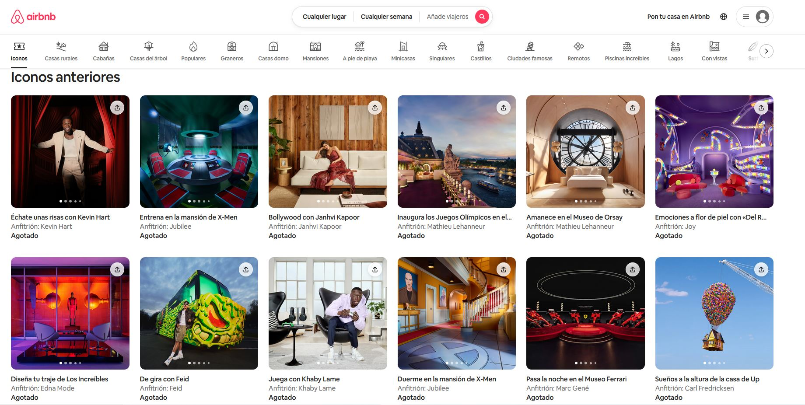
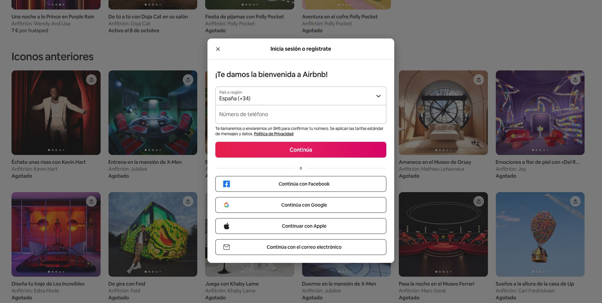
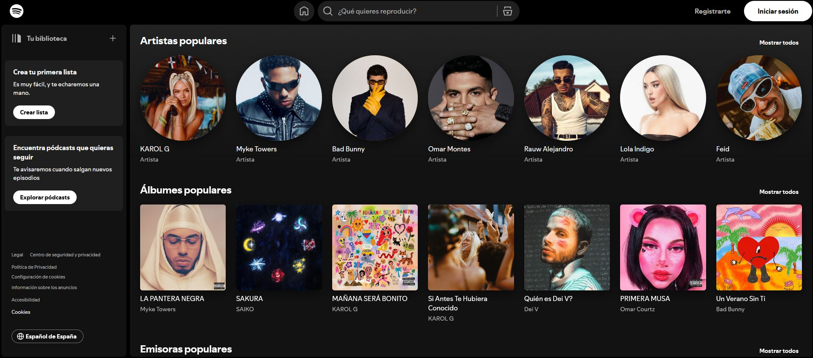
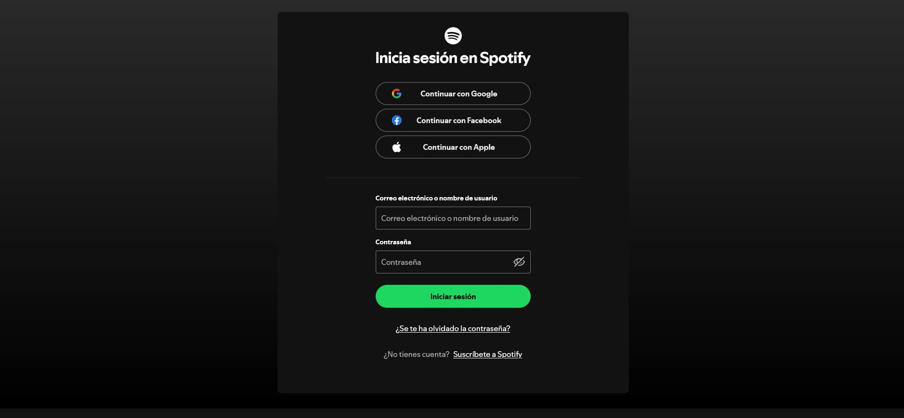
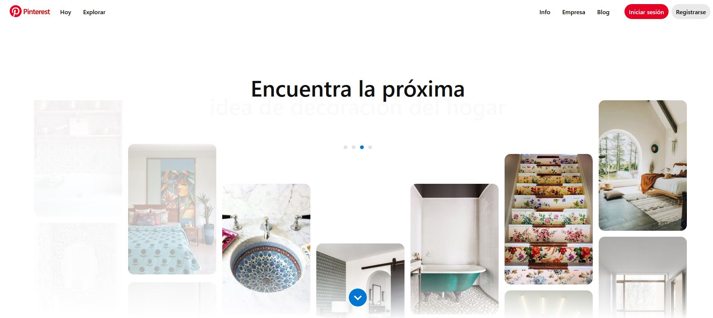
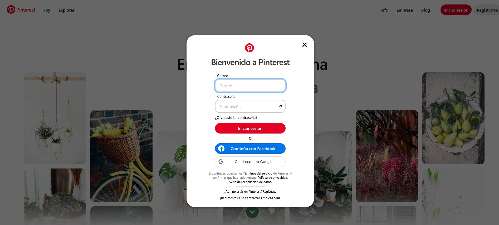

# CheckPoint 18

## Modales - Qué son y para qué se utilizan

  

En React, un Modal es un componente de la interfaz que “sale y entra” en la interfaz, es decir, se superpone al contenido de la página con el fin de mostrar información adicional, mostrar avisos o para que el usuario de la página tenga que realizar alguna acción. Se podría decir que es como una ventana emergente que aparece sobre el contenido, y se puede configurar de tal modo que se oscurezca o se desenfoque el fondo para que se resalte más.

**Los modales en React no tienen otro objetivo más que mejorar la experiencia del usuario, mostrando el contenido sin necesidad de navegar a otra página, agilizando la interacción.**

Por otro lado, los modales se colocan en puntos estratégicos en las aplicaciones web, con el fin de dirigir la atención del usuario hacia información específica, avisos importantes, etc. Además, estos elementos pueden contener diferentes tipos de contenido, así como formularios, imágenes, mensajes de confirmación, información detallada, etc., siendo muy versátiles en el desarrollo de aplicaciones web.

Para entender completamente el uso de modales, se exponen unos cuantos ejemplos a continuación: 

#### Ejemplo 1 – Web de [AirBnB](https://www.airbnb.com/)

  

El modal de inicio de sesión de Airbnb aparece como una ventana superpuesta que oscurece el fondo de la página principal. Contiene opciones para iniciar sesión con diferentes métodos, como correo electrónico, Facebook o Google.

  

---

#### Ejemplo 2 - Web de [Spotify](https://www.spotify.com/) 

  

El modal de inicio de sesión de Spotify aparece como una ventana superpuesta que oscurece el fondo de la página principal. Esta ventana aparece también en medio y contiene opciones para iniciar sesión mediante diferentes plataformas o bien mediante un correo electornico y una contraseña. Además, da opciones por si se te ha olvidado la contrasela o por si quieres suscribirse a Spotify.

  
</
  
---

#### Ejemplo 3 -  web de [Pinterest](https://www.pinterest.com/)

  

El modal de inicio de sesión de Pinterest aparece también como en los dos anteriores ejemplos, como una ventana superpuesta que oscurece el fondo de la página principal. 

  

A parte de los ejemplos que se han expuesto, los modales pueden usarse también para otras acciones, así como para **confirmaciones** (eliminar datos, cerrar sesión, etc.), **ampliar detalles o información sin interrumpir el flujo principal de la aplicación** (así como es el caso de Booking, para poder ver el alojamiento seleccionado sin dejar atrás la búsqueda realizada), **notificar mensajes de error o éxito**, así como ofrecer instrucciones paso a paso a modo de **guía o tutoriales**.

---

---

## Scroll infinito

  

En React, un scroll infinito o infinite scroll es una técnica para cargar los datos según sea necesario, es decir, el contenido se va cargando de forma continua a medida que el usuario se desplaza hacia abajo en la página, sin tener la necesidad de clicar en botones de siguiente página o similares. 
 
Aquí, en el renderizado inicial solo se solicita una parte del contenido (que es el que se ve en pantalla), y al llegar al final de la página, vuelve a cargar las siguientes partes para que el usuario pueda seguir consultando o viendo el contenido.

El scroll infinito tiene como fin mejorar la experiencia del usuario, permitiendo una navegación más fluida y sin interrupciones. A diferencia de la paginación, carga el contenido de una forma más homogénea, y mejora los tiempos de carga, siendo de este modo más eficiente en cuanto al rendimiento.

En cuanto a usos del scroll infinito, estos son muy numerosos y aparecen en muchas aplicaciones tanto web como móviles.

Ejemplo 1 – Instagram
Instagram usa el scroll infinito para mostrar un flujo continuo de publicaciones. Este mismo mecanismo la usan otras apps como Facebook, o X.
--- 
Ejemplo 2 – Tik tok

---
Ejemplo 3 – Pinterest

Actualmente hay otras muchas aplicaciones web que utilizan el scroll infinito, así como:
Amazon: implementa listados de productos para facilitar la exploración de grandes catálogos.
Tumblr: Utiliza el scroll infinito para mostrar publicaciones de blogs de manera continua. 
LinkedIn: En el feed de noticias se utiliza el scroll infinito, ya que carga constantemente nuevas actualizaciones profesionales a medida que el usuario se desplaza. 
