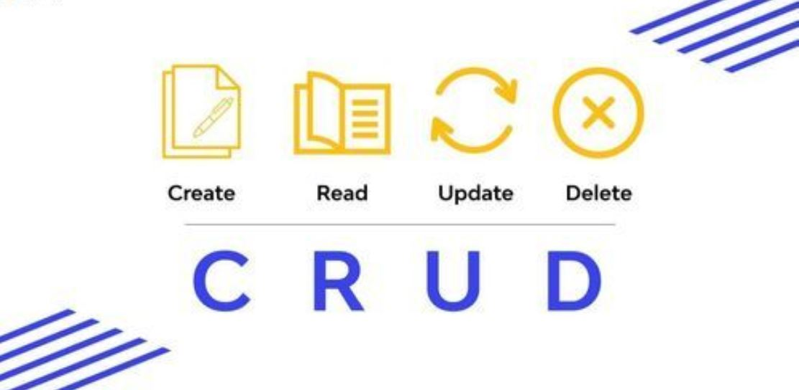

# CheckPoint 18

## Modales - Qué son y para qué se utilizan

En React, un Modal es un componente de la interfaz que “sale y entra” en la interfaz, es decir, se superpone al contenido de la página con el fin de mostrar información adicional, mostrar avisos o para que el usuario de la página tenga que realizar alguna acción. Se podría decir que es como una ventana emergente que aparece sobre el contenido, y se puede configurar de tal modo que se oscurezca o se desenfoque el fondo para que se resalte más.
Los modales en React no tienen otro objetivo más que mejorar la experiencia del usuario, mostrando el contenido sin necesidad de navegar a otra página, agilizando la interacción. Por otro lado, los modales se colocan en puntos estratégicos en las aplicaciones web, con el fin de dirigir la atención del usuario hacia información específica, avisos importantes, etc. Además, estos elementos pueden contener diferentes tipos de contenido, así como formularios, imágenes, mensajes de confirmación, información detallada, etc., siendo muy versátiles en el desarrollo de aplicaciones web.

Para entender completamente el uso de modales, se exponen unos cuantos ejemplos a continuación:
Ejemplo 1 – Web de AirBnB https://www.airbnb.com/

  

El modal de inicio de sesión de Airbnb aparece como una ventana superpuesta que oscurece el fondo de la página principal. Contiene opciones para iniciar sesión con diferentes métodos, como correo electrónico, Facebook o Google.

  

---
Ejemplo 2 - Spotify 

  

El modal de inicio de sesión de Spotify aparece como una ventana superpuesta que oscurece el fondo de la página principal. Esta ventana aparece también en medio y contiene opciones para iniciar sesión mediante diferentes plataformas o bien mediante un correo electornico y una contraseña. Además, da opciones por si se te ha olvidado la contrasela o por si quieres suscribirse a Spotify.

  
</
---
Ejemplo 3 -  Pinterest

  

El modal de inicio de sesión de Pinterest aparece también como en los dos anteriores ejemplos, como una ventana superpuesta que oscurece el fondo de la página principal. 

  
</

A parte de los ejemplos que se han expuesto, los modales pueden usarse también para otras acciones, así como para confirmaciones (eliminar datos, cerrar sesión, etc.), ampliar detalles o información sin interrumpir el flujo principal de la aplicación (así como es el caso de Booking, para poder ver el alojamiento seleccionado sin dejar atrás la búsqueda realizada), notificar mensajes de error o éxito, así como ofrecer instrucciones paso a paso a modo de guía o tutoriales.

